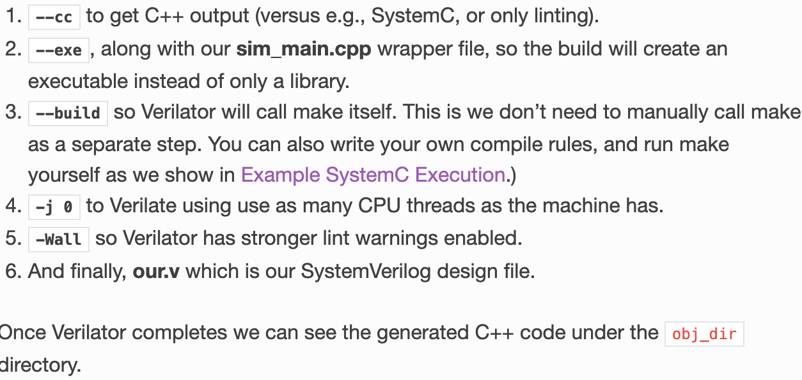

#  preliminaries
## verilator
可以将verilog代码变成C++或system C代码，是个开源的验证verilog代码的工具，是个compiler。[这](https://verilator.org/guide/latest/index.html)是官方网站。
将代码从verilog变成c++的过程叫做to verilate，之后的代码叫verilated code。在写好之后，如果我们要仿真，我们还需要instantiation。我们作为用户需要提供cpp wrapper文件，里面生成了一个struct是仿真的单元。
## chisel
又叫凿子 是电路设计的语言，类似verilog，但是比verilog更高一层，在应用的时候要先变为verilog。
# 安装verilator
安装verilator有2个途径，一个是用package manager，还有一个是用git。我们使用的是git。
安装官网的步骤来，将optional的package也安上了。但是没有安装GTKwave和Z3。GTKwave是一个接受fst文件显示波形的软件，而Z3可以支持constrained randomization的功能。
从git安装verilator的方法就是经典的使用GNU的AUTOCONF和AUTOMAKE产生的程序的安装步骤。具体包括：
1. ./autoconf:为了生成configure文件
2. ./configure:用来检测你的安装平台的目标特征的。比如它会检测你是不是有CC或GCC，并不是需要CC或GCC，它是个shell脚本；运行完成之后会建立Makefile文件。
3. make:编译，根据./configure生成的文件
4. make install:把编译生成的文件添加到文件夹里，比如将生成的可执行文件添加到bin文件夹里。这一步需要sudo。
5. 如果后悔了 就是sudo make uninstall。如果想删除临时文件，就make clean

# 使用verilator
## command line
Now we run Verilator on our little example.
```
verilator --binary -j 0 -Wall our.v
```
Breaking this command down:

*--binary* telling Verilator to do everything needed to create a simulation executable.

*-j 0* to Verilate using use as many CPU threads as the machine has.

*-Wall* so Verilator has stronger lint warnings enabled.

An finally, our.v, which is our SystemVerilog design file.

在有cpp wrapper之后，用这个命令进行simulation。
```
verilator --cc --exe --build -j 0 -Wall sim_main.cpp our.v
```

上一步是生成binary这一步是生成executable文件。这里将-- binary换成--exe，--cc指cpp，--sc指system C。

如果画波形图，用到了VerilatedFstC这个类，则需要在命令行命令里加上--trace-fst这个flag

## cpp wrapper file
``` cpp
  #include "Vour.h"
  #include "verilated.h"
  int main(int argc, char** argv) {
      VerilatedContext* contextp = new VerilatedContext;
      contextp->commandArgs(argc, argv);
      Vour* top = new Vour{contextp};
      while (!contextp->gotFinish()) { top->eval(); }
      delete top;
      delete contextp;
      return 0;
  }
```
verilator会接受你写的our.v并自动生成Vour.h头文件供使用。verilated.h是系统头文件。

在cpp wrapper file里，顶层模块是一个类，指向这类的一个指针是基础。我们实例化的顶层模块类内部，包含了命令行的参数信息和波形的信息（下面有实例），所以要先创建三个类，之后让顶层模块指向这两个。
## 如何交互，verilator做了什么
VerilatedContext是一个object，专门容纳simulation time, global settings, and simulation state等信息。先创建个新的再将其的member：commandArgs的参数设置为argc argv就可以让我们从命令行更改仿真的选项。
下面是对我们的模块进行实例化。创建一个指向Vour类型的指针，并且用new新分配一块内存，将contextp传递给constructor。
eval()函数可以根据当前的state算输出。gotFinish()在看到\$finish;之后就为1，所以这个仿真流程持续直到见到$finish;
下面的2个delete是为了释放内存。

The C++ wrapper is your testbench or simulation control program that:

- Provides stimulus to your design's inputs
- Controls the clock and reset signals
- Monitors the outputs
- Advances simulation time
- Performs verification checks

v只是描述电路，verilator将v的电路模块转换为cpp里的一个类，cpp wrapper文件可以通过给类的变量赋值，调用类的member function，进而决定往里面传什么参数，类似于vivado里面的testbench作用。比如verilog文件里有clk信号，在wrapper里就可以用top->clk来调用。同时top->eval()也是成员函数。

在verilator根据v文件生成的cpp文件里可以看到，它创建了一个类，并将eval()和输入输出都变成了该类的成员变量和成员函数。eval函数的实现就依赖于v文件里模块逻辑的编写。比如continuous assignment变成一种cpp里的赋值语法，procedural assignment变成另一种，其实就是将verilog逻辑用cpp写出来。

和vivado等仿真工具不同，verilator对于电路输出的更新是间断性的，每个周期只更新一次，而不是像vivado里面的持续追踪波形甚至能看出周期间的glitch。并且不会有电路底层结构带来的timing等问题。本质上只是把verilog的逻辑转换成cpp的逻辑，每个周期求一次数而已。

verilator几乎无法编译所有non-synthesizable的语句。
## 仿真流程
按照上面的命令行来，编译完成后运行./obj_dir/Vtop(module name)来运行。可以通过-o来调整verilator生成可执行文件的位置和名字。
如果cpp里没写print，输出结果什么都没有，但是已经运行完成。一般情况下都是反复循环输出直到ctrl c人工中断。
以下是一个画波形图的具体cpp wrapper文件实例：
``` c++
#include "verilated_fst_c.h"
#include "Vtop.h"
#include "verilated.h"
#define MAX_TIME 100
  int main(int argc, char** argv) {
      VerilatedContext* contextp = new VerilatedContext;
      Verilated::traceEverOn(true);
      VerilatedFstC* tfp=new VerilatedFstC;
      contextp->commandArgs(argc, argv);
      Vtop* top = new Vtop{contextp};
      top->trace(tfp,99);
      tfp->open("counter_sim.fst");
      int sim_time=0;
      while (!contextp->gotFinish() & sim_time<MAX_TIME) {
              top->clk=(sim_time%2);
              top->reset=0;
              top->eval();
              tfp->dump(sim_time);
              sim_time++;
      }
      tfp->close();
      delete tfp;
      delete top;
      delete contextp;
      return 0;
  }

```
这里是通过gotFinish()和sim_time>MAX_TIME两个条件来限制的。
画波形图需要注意按以下顺序：
1. 引用多一个文件
2. Verilated:traceEvenOn(true)
3. 新声明一个VerilatedFstC指针变量
4. top有个member function叫trace专门负责输出波形的，指向上面的指针变量，另一个参数99是输出的信号追踪的hierarchy，一般都写99就可以。
5. VerilatedFstC本身有个member function open意思是将波形输出到这个文件里。
6. 上文的tfp->dump意思就是将某一时刻的参数dump进对应的fst波形文件。在dump之前要先eval()，是为了更新输出值。
7. 最后别忘了delete指针变量。

在运行了对应文件（.obj_dir/Vtop）之后才会有对应的波形文件。用gtkwave 文件名来查看波形。

# 接入NVboard
总体的工作流程就是：写verilog代码，通过verilator编写为cpp代码，在通过NVboard将cpp代码和虚拟FPGA连接，最后的效果就是编写的verilog代码在FPGA上运行了
## NVboard examples
关于examples的理解，可以看如下的makefile的注释：
```
TOPNAME = top
# the constraint file. There are two ways to bind pin and signals, one of which is by nxdc file.
NXDC_FILES = constr/top.nxdc
# this is for additional files to include
# ?= means if not defined, define.
# This INC_PATH is passed to cpp compiler so any file that needs to be included in cpp use this variable.
INC_PATH ?=

VERILATOR = verilator
VERILATOR_CFLAGS += -MMD --build -cc  \
				-O3 --x-assign fast --x-initial fast --noassert

BUILD_DIR = ./build
OBJ_DIR = $(BUILD_DIR)/obj_dir
BIN = $(BUILD_DIR)/$(TOPNAME)

default: $(BIN)

# First mkdir a folder called build
$(shell mkdir -p $(BUILD_DIR))

# constraint file
SRC_AUTO_BIND = $(abspath $(BUILD_DIR)/auto_bind.cpp)
$(SRC_AUTO_BIND): $(NXDC_FILES)
# this is for generating the auto_bind.cpp file based on the nxdc file.
# The result is that under the build folder there is a file called auto_bind.cpp
	python3 $(NVBOARD_HOME)/scripts/auto_pin_bind.py $^ $@

# project source
# VSRCS is every v file under vsrc folder
# CSRCS is every c/c++ file under csrc folder + auto_bind.cpp
VSRCS = $(shell find $(abspath ./vsrc) -name "*.v")
CSRCS = $(shell find $(abspath ./csrc) -name "*.c" -or -name "*.cc" -or -name "*.cpp")
CSRCS += $(SRC_AUTO_BIND)

# rules for NVBoard
include $(NVBOARD_HOME)/scripts/nvboard.mk

# rules for verilator
# addprefix is a makefile function
# this line means to add -I in front of every item in INC_PATH
INCFLAGS = $(addprefix -I, $(INC_PATH))
# CXXFLAGS will be passed to verilator as the cpp compiler flag in which -DTOP_NAME is a cpp file micro. Command line macro has high priority than ones in cpp file.
CXXFLAGS += $(INCFLAGS) -DTOP_NAME="\"V$(TOPNAME)\""

# executable is generated under build folder, not obj_dir folder. 
# this is done by the -o and ./build/top flag which specifies the name and location. 
# Everything after -CFLAGS is passed to verilator as the cpp compiler used to compile cpp files. Verilator supports this kind of flag passing.
$(BIN): $(VSRCS) $(CSRCS) $(NVBOARD_ARCHIVE)
	@rm -rf $(OBJ_DIR)
	$(VERILATOR) $(VERILATOR_CFLAGS) \
		--top-module $(TOPNAME) $^ \
		$(addprefix -CFLAGS , $(CXXFLAGS)) $(addprefix -LDFLAGS , $(LDFLAGS)) \
		--Mdir $(OBJ_DIR) --exe -o $(abspath $(BIN))

all: default

run: $(BIN)
	@$^

clean:
	rm -rf $(BUILD_DIR)

.PHONY: default all clean run
```

关于模块的命名需要注意：传递给verilator有2个flags和这个有关。一个是--prefix，另一个是--top-module。--top-module用在，当有很多个module的时候，声明哪一个module为顶层模块。后面接的字符串是verilog文件里声明的module的名字。在verilator工作的时候，是将你的top module转化为一个cpp类，你通过类的interface和其交互。这个类的名字由--prefix来说明，--prefix同样也决定了引用的header file的名字（一般都是Vtop.h）。--prefix没有设置时，默认是top level module的名字加V。在这个makefile里，将top_name宏定义为V+top_name，所以cpp文件里的所有top-name都换成Vtop。

只需要type make就可以生成相应的界面，运行试验。

nxdc文件的编写可见项目的readme文件。注意绑定管脚有2个方法：一个是在cpp文件里手动写nvboard_bind_pin函数，一个一个管脚写，还有一种方法是先写nxdc文件，再通过python程序将nxdc文件翻译为一个auto_bind.cpp文件，最后include这个文件，实现相同的效果。
## 总结
如果想将verilog代码接入到nvboard上，只需要在cpp wrapper文件里面引用<nvboard.h>，之后调用init bind_all_pins update等接口即可。
在我个人的实践中（macbook M1 pro 16+512，ubuntu24.01 verilator 5.034），发现画波形和调用nvboard无法同时存在，nvboard会一闪就消失，有可能是ram分配不够导致的。
